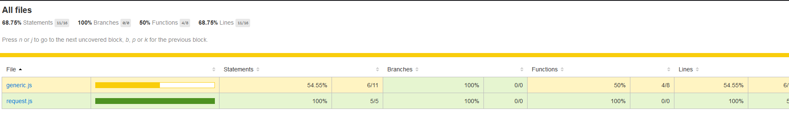
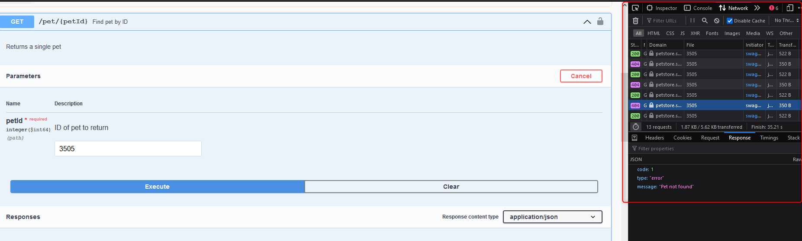

# API Tests for the Pets!

## Table of Contents
  * [Table of Contents](#table-of-contents)
  * [How to run](#how-to-run)
    + [Setup](#setup)
    + [Run tests](#run-tests)
      - [Execute tests without any extra reporting](#execute-tests-without-any-extra-reporting)
      - [Execute tests with coverage](#execute-tests-with-coverage)
    + [TechStack Info](#techstack-info)
  * [Test design details](#test-design-details)
    + [Swagger observations](#swagger-observations)
    + [Pseudocode case 1 "Add a new pet to the petstore"](#pseudocode-case-1--add-a-new-pet-to-the-petstore-)
    + [Pseudocode case 2 "Add a new pet without image should fail"](#pseudocode-case-2--add-a-new-pet-without-image-should-fail-)
    + [Pseudocode case 3 "Add a new pet without name should fail"](#pseudocode-case-3--add-a-new-pet-without-name-should-fail-)
    + [Pseudocode case 4 "Add a new pet with pending status"](#pseudocode-case-4--add-a-new-pet-with-pending-status-)
  * [Contact](#contact)

## How to run
### Setup
1. Clone this repository `git clone git@gitlab.com:wioletta.miklasewicz/pet-store-challenge.git`
2. Inside project folder execute `npm install`

### Run tests
#### Execute tests without any extra reporting
Execute `npm test` command inside project

#### Execute tests with coverage
Execute `npm run test-coverage` command inside project. To see the html report after test execution go to the coverage folder and open index.html in the web browser.
 <p>
    
</p>

### CI/CD
File .gitlab-ci.yml contains example setup for test execution based on the start variable and generating allure report with usage gitlab pages (it's failing at the moment as there are not any active runners assigned to that account).

### TechStack Info
- API Test Framework: Jest + Supertest
- BDD approach with usage of the Cucumber
- Added support for allure to get a nice reports
- Enabled jest test coverage

## Test design details
### Swagger observations
Swagger (pet service) unfortunately contains a few bugs that can affect the stability of the tests:
- Required fields are not validated from the api level, so user can create a new pet without passing the name or image, in that case swagger should return 405 code response (invalid input), but we are getting code 200.
 <p>
    
</p>
Anyway, I stick with the expected responses and codes in my tests according to the model definition.
- There is no validation for petId, so newly created pets are not properly saved if a pet with this id already exists. There is also no validation error that could refer to that.
- Get pet endpoint returns different responses from time to time e.g.
 <p>
    
</p>

### Pseudocode case 1 "Add a new pet to the petstore"
Positive case, to make sure user can create a pet, as a proof that pet should be available in the store. According to the above swagger issues, and in reality, we can't just trust 200 response when saving.

```
def Add a new pet to the store
    petId = generate random petId
    payload = create pet request body with valid data

    # receive GET '/' request to do healthcheck for pet store
    check validations
        then
            expect status 200

    # receive POST '/pet' request with payload
    check validations
        expect content type header
        expect status 200
            then
                expect body not null
                expect typeof body object
                expect id == petId

    # receive GET '/pet/petId' request with param: petId
    check validations
        expect content type header
        expect status 200
            then
                expect body == payload
            catch
                error    
```

### Pseudocode case 2 "Add a new pet without image should fail"
Negative case to validate one of required values based on the model reference - image.

```
def Add a new pet without image should fail
    petId = generate random petId
    payload = create pet request body without image

    # receive GET '/' request to do healthcheck for pet store
    check validations
        then
            expect status 200

    # receive POST '/pet' request with payload
    check validations
        expect content type header
        expect status 405
            then
                expect body not null
                expect body type error

    # receive GET '/pet/petId' request with param: petId
    check validations
        expect content type header
        expect status 404
            then
                expect body type error
                expect error message
```

### Pseudocode case 3 "Add a new pet without name should fail"
Negative case to validate one of required values based on the model reference - name.

```
def Add a new pet without name should fail
    petId = generate random petId
    payload = create pet request body without name

    # receive GET '/' request to do healthcheck for pet store
    check validations
        then
            expect status 200

    # receive POST '/pet' request with payload
    check validations
        expect content type header
        expect status 405
            then
                expect body not null
                expect body type error

    # receive GET '/pet/petId' request with param: petId
    check validations
        expect content type header
        expect status 404
            then
                expect body type error
                expect error message
```
### Pseudocode case 4 "Add a new pet with pending status"
Positive case when adding a new pet with specific status field to make sure it's set correctly.

```
def Add a new pet with pending status
    petId = generate random petId
    payload = create pet request body with valid data and status = pending

    # receive GET '/' request to do healthcheck for pet store
    check validations
        then
            expect status 200

    # receive POST '/pet' request with payload
    check validations
        expect content type header
        expect status 200
            then
                expect body not null
                expect body status == pending
                expect typeof body object

    # receive GET '/pet/petId' request with param: petId
    check validations
        expect content type header
        expect status 200
            then
                expect body == payload
            catch
                error 
```

## Contact

Wioletta Mikłasewicz - https://www.linkedin.com/in/wioletta-kisielewicz

